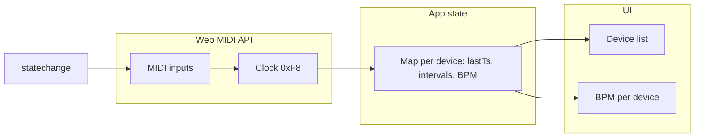

# midiclock Web Application Plan

> **Overview**: Build a dependency-free web app that uses the Web MIDI API to detect MIDI clock (0xF8) from each connected input, compute smoothed BPM per device, and show a dark-mode UI listing devices and their tempos.  
> This file is the single source of truth for the plan; update it as we refine the project.

---

## Scope

- **Stack**: Plain HTML, TypeScript (compiled to JS with `tsc`), and CSS. No npm runtime dependencies; no third-party libraries.
- **API**: Web MIDI API only (`navigator.requestMIDIAccess()`, `MIDIInput.onmidimessage`, `MIDIAccess.statechange`).
- **UI**: Single page, dark mode, list of connected MIDI devices with a distinct BPM value per device.

---

## 1. Project structure

```
midiclock/
├── .gitignore          # dist/, node_modules/
├── index.html          # Entry page, links CSS and compiled JS
├── package.json        # Minimal: typescript dev dependency, build script
├── tsconfig.json       # Target ES2020+, outDir: dist, no bundler
├── midiclock.plan.md   # This plan (kept updated as we plan)
├── src/
│   ├── main.ts         # App logic: MIDI access, clock handling, BPM, DOM updates
│   └── style.css       # Dark-mode styles
├── dist/               # tsc output (e.g. gitignore)
│   └── main.js
```

- **Build**: Use a minimal `package.json` with `typescript` as a dev dependency and a `build` script that runs `tsc` (e.g. `"build": "tsc"`). Run `npm run build` to produce `dist/main.js`; `index.html` loads it with one `<script src="dist/main.js">`. No modules required (single TS file or `tsc` with one entry).
- **TypeScript**: `tsconfig.json` with `"target": "ES2020"`, `"outDir": "dist"`. The built-in DOM lib includes Web MIDI types; no extra `.d.ts` needed.

---

## 2. MIDI clock and BPM logic (in `main.ts`)

**MIDI clock**: System real-time message with status byte `0xF8`. Sent 24 times per quarter note (PPQ = 24).

**BPM formula**: For a sequence of clock messages, measure the time between consecutive ticks. One quarter note = 24 ticks, so average interval between ticks (in ms) × 24 = duration of one quarter note in ms, and:

`BPM = 60_000 / (avgIntervalMs * 24)`

**Per-input state**: For each `MIDIInput`, keep:

- `lastTimestamp: number` (from `performance.now()` or `Date.now()` when we receive 0xF8).
- A small circular buffer of the last N inter-tick intervals (e.g. N = 24 or 48) to smooth jitter.

**Algorithm**:

1. On `midimessage`, if `event.data[0] === 0xF8`:
   - `now = performance.now()`
   - If we have a previous timestamp, push `now - lastTimestamp` into the buffer and recompute average interval, then `bpm = 60000 / (avgInterval * 24)`.
   - Update `lastTimestamp = now`.
2. Throttle DOM updates (e.g. `requestAnimationFrame` or update at most every 100–200 ms) so the UI doesn't flicker.

**Device list**: On load, call `requestMIDIAccess()`, then iterate `midiAccess.inputs` and attach `onmidimessage` to each input. Subscribe to `midiAccess.onstatechange` to refresh the list when devices are connected or disconnected; re-attach handlers for new inputs and remove references for disconnected ones. Keep a single source of truth: a `Map<MIDIInput.id, { input, lastTimestamp, intervals[], bpm }>` (or key by id string).

---

## 3. UI and layout (`index.html` + `style.css`)

**Content**:

- A title (e.g. "midiclock") and short line of copy (e.g. "MIDI clock → BPM").
- A "Connected MIDI devices" section:
  - If no devices: message like "No MIDI devices found. Connect a device and refresh."
  - If Web MIDI unsupported: "Web MIDI API is not supported in this browser."
  - For each connected input: show **device name** (e.g. `input.name`) and **BPM** (e.g. "120.0 BPM"), or "— BPM" when no clock has been received yet for that device.

**Dark mode**:

- Background: dark gray/black (e.g. `#0d0d0d` or `#1a1a1a`).
- Text: light gray/white (e.g. `#e0e0e0`).
- Accent: one subtle highlight color for titles or BPM values (e.g. a muted cyan or green) to keep it simple but stylish.
- Cards or rows per device: subtle border or background difference so each device is clearly separated.

**Style**:

- Clean typography (system font stack or a single webfont if you prefer).
- Comfortable spacing and alignment; BPM can be emphasized (e.g. larger or bold) so it's scannable.

No JavaScript frameworks; all DOM updates from `main.ts` (create/update device rows and BPM text from the per-device state).

---

## 4. Data flow (high level)



- **statechange** → refresh which inputs we listen to and sync the device list in the DOM.
- **midimessage (0xF8)** → update that input's state (intervals, BPM) and, when we next paint, update that device's BPM in the UI.

---

## 5. Security and environment

- Web MIDI requires a **secure context** (HTTPS or `http://localhost`). The plan assumes the app is opened via a local server (e.g. `npx serve .` or VS Code Live Server) or over HTTPS.
- No `sysex` option needed for clock; `requestMIDIAccess()` can be called with no arguments or `{}`.

---

## 6. Implementation order

1. **Scaffold**: Create `package.json` (minimal: `typescript` dev dependency, `"build": "tsc"`), `tsconfig.json` (compile `src/main.ts` → `dist/main.js`), `index.html` (structure + placeholder device list container), and `src/style.css` (dark theme, layout, device cards).
2. **MIDI and BPM**: In `main.ts`, implement `requestMIDIAccess()`, list inputs, attach `onmidimessage`, filter 0xF8, maintain per-input timestamps and interval buffer, compute smoothed BPM.
3. **Device list UI**: Render device list from `midiAccess.inputs`; show name and BPM (or "—") for each; handle empty state and "unsupported" state.
4. **Statechange**: On `statechange`, re-build the inputs list, re-attach handlers, and re-render the device list so new/removed devices appear without reload.
5. **Polish**: Throttle BPM DOM updates, finalize dark-mode colors and typography, and ensure one clear BPM per device.

---

## 7. Files to add (summary)

| File | Purpose |
|------|--------|
| [.gitignore](.gitignore) | Ignore `dist/` and `node_modules/` |
| [package.json](package.json) | Minimal: `typescript` dev dependency, `"build": "tsc"` script |
| [tsconfig.json](tsconfig.json) | Compile TS → `dist/main.js`, no bundler |
| [index.html](index.html) | Page structure, link to `dist/main.js` and `src/style.css` |
| [src/main.ts](src/main.ts) | MIDI access, clock parsing, BPM math, device state, DOM updates |
| [src/style.css](src/style.css) | Dark theme, layout, device list and BPM styling |
